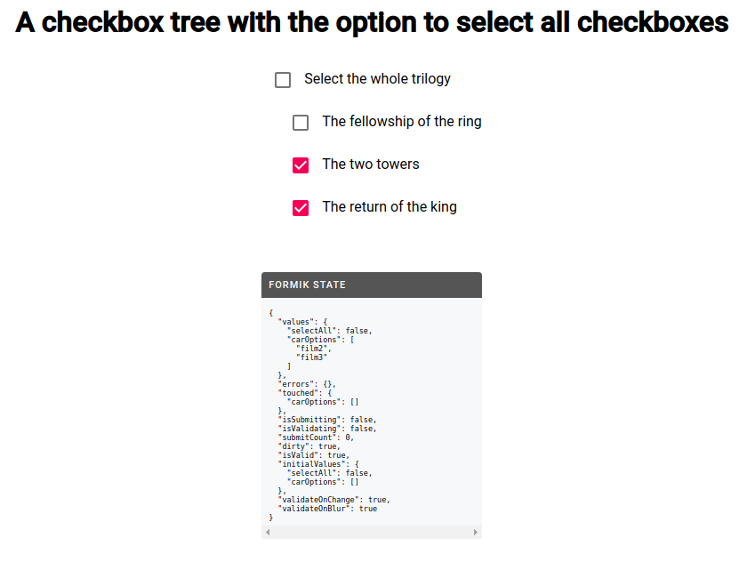

## Checkbox tree

### This (simple) checkbox tree is made using [Formik](https://github.com/jaredpalmer/formik). 

### It has a parent checkbox that allows to auto-select/unselect all children checkboxes. 

* A partial selection of the list of children checkboxes will auto-unselect the parent checkbox as could be expected. 
* A complete selection of the list of children checkboxes will auto-select the parent checkbox, as could be expected.

I used material-UI for the styling.

A screenshot below :

